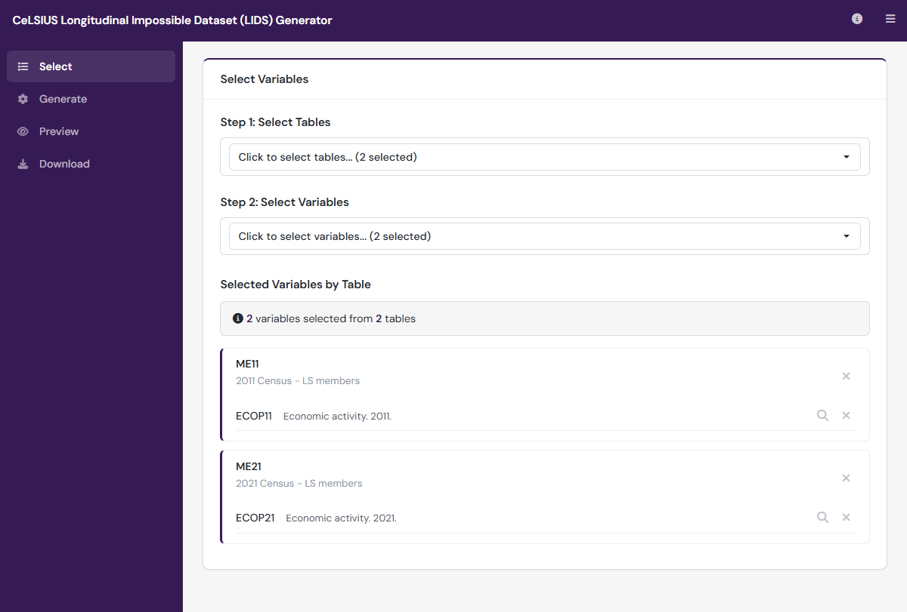

# celsiuslids 

[](https://doi.org/10.5281/zenodo.20344702) [](LICENSE.md) [](https://github.com/CeLSIUS-UCL/celsiuslids/actions/workflows/R-CMD-check.yaml)

This R package can be used to run the CeLSIUS Longitudinal Impossible Dataset (LIDS) application locally. The application can be used to generate impossible datasets resembling data extracts from the ONS Longitudinal Study (ONS LS).



## Installation

You can install the package from GitHub:

```r
# install.packages("remotes")
remotes::install_github("CeLSIUS-UCL/celsiuslids")
```

### Dependencies

The celsiuslids package requires the following R packages:

- shiny, shinydashboard, shinyWidgets
- DT
- dplyr, tidyr, purrr (tidyverse)
- haven (for Stata/SPSS export)
- zip
- jsonlite
- DBI, RSQLite
- digest

These will be installed automatically when you install the package.

## Usage

Launch the application with a single command:
```r
library(celsiuslids)
run_lids_app()
```

This will open the LIDS application in your default web browser.

### Optional Parameters

```r
# Run on a specific port
run_lids_app(port = 3838)

# Run without opening browser (useful for servers)
run_lids_app(launch.browser = FALSE)

# Combine options
run_lids_app(port = 8080, launch.browser = FALSE, host = "0.0.0.0")
```

## Application Workflow

The application follows a four-step workflow accessible via the sidebar:

### 1. Select Variables

Choose which tables and variables to include in your impossible dataset:

1. **Select Tables**: Use the searchable dropdown to select one or more ONS LS tables. Each table shows its description to help you identify the right data source.

2. **Select Variables**: After selecting tables, choose specific ONS LS variables from those tables. Variables are grouped by table and show their descriptions.

3. **Review Selection**: A summary panel displays your selections organised by table, with options to:
   - Remove individual variables (click the × next to a variable)
   - Remove all variables from a table (click the × next to the table name)
   - View variable documentation (click the magnifying glass icon)

> **Note**: The `CORENO` variable (record identifier) is automatically added if you select any table that contains it, ensuring datasets can be linked.

### 2. Generate Dataset

Configure how your synthetic data should be generated:

- **Number of Observations**: Set how many rows to generate (default: 100, max: 550,000)
- **Random Seed**: Optionally set a seed for reproducible results
- **Include All Unique Codes**: When checked, ensures every possible code value appears at least once (adjusts minimum observations if needed)

Click **Generate Dataset** to create your synthetic data.

### 3. Preview

View your generated data before downloading:

- Data is displayed in interactive tables with one tab per table
- Use **Show Labels** / **Show Values** to toggle between displaying code values and their human-readable labels
- Preview shows a random sample of up to 100 rows per table
- Search, sort and paginate the data

### 4. Download

Export your generated dataset:

**File Formats**:
- **CSV**: Comma-separated values (universal compatibility)
- **RDS**: R native format (preserves data types)
- **DTA**: Stata format
- **SAV**: SPSS format

**Options**:
- **Include Codelist**: Adds a reference file mapping codes to labels

Downloaded files are packaged in a ZIP archive with:
- One data file per selected table
- Optional codelist file
- All variable names are written in lower case with an upper-case `_LIDS` suffix (e.g. `var1_LIDS`) to clearly identify the impossible data (table and file names are unchanged)

## Additional notes

### Generated Variables

Each variable in the generated dataset contains:
- Randomly sampled values from its code list as extracted from the public CeLSIUS data dictionary
- Appropriate data types (numeric or character) based on metadata

### CORENO Linking

When generating data from multiple tables, `CORENO` (the core record number) is:
- Automatically included if present in selected tables
- Assigned unique sequential values
- Consistent across all tables (enabling joins)

### Multi-entry tables

Most tables contain exactly one row per `CORENO`. A number of tables, however, can legitimately hold **several records per LS member** — for example the non-LS-member census tables (`NM71`–`NM21`) or event registrations such as cancers (`CANC`) and births (`LBSM`, `SBSM`, `LBSF`, `SBSF`). For these tables LIDS generates a **random number of rows per `CORENO` (1–5)**, with every `CORENO` appearing at least once, up to a per-table ceiling of **600,000 rows**. Every `CORENO` value is still shared across tables, so the generated tables remain linkable.

The full list of multi-entry tables is: `NM71`, `NM81`, `NM91`, `NM01`, `NM11`, `NM21`, `EMBR`, `CANC`, `LBSM`, `SBSM`, `IDMI`, `WDOW`, `ENLS`, `REEN`, `LBSF`, `SBSF`.

## Notifications

The application provides feedback through:
- **Toast notifications**: Brief messages for actions (success, warnings, errors)
- **Bell icon**: Click to see a history of recent notifications with timestamps

## Citing

If you use LIDS, please cite it via its DOI: https://doi.org/10.5281/zenodo.20344702 (this concept DOI always resolves to the latest version; cite a specific version's DOI for reproducibility). GitHub's "Cite this repository" button generates a full citation from `CITATION.cff`.

## Data source

The table, variable, and code-list metadata bundled with LIDS is derived from the public CeLSIUS data dictionary for the ONS Longitudinal Study, which is © Crown Copyright and made available under the [Open Government Licence v3.0](https://www.nationalarchives.gov.uk/doc/open-government-licence/version/3/). LIDS contains no real ONS LS data.

## Funding

This project was funded by the Economic and Social Research Council (ESRC) as part of the [Census Innovation at CeLSIUS](https://gtr.ukri.org/projects?ref=ES%2FZ502741%2F1) grant (ES/Z502741/1).

## Contact

For questions, support or feedback please contact CeLSIUS at [celsius@ucl.ac.uk](mailto:celsius@ucl.ac.uk).


